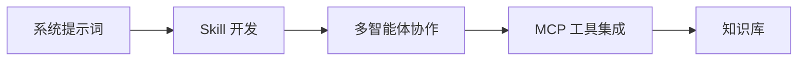

# 开发者指南

Remote Control Server (RCS) 开发者指南，面向使用 RCS 平台构建 AI Agent 的开发者。

## 你能做什么

RCS 是一个 AI Agent 控制面板，帮助你构建、配置和管理智能体。作为开发者，你可以：

- **定义 Agent 角色** — 通过系统提示词和参数配置，塑造不同职责的 Agent
- **编写 Skill** — 用 Markdown 编写技能指令，让 Agent 学会新的工作流程
- **接入外部工具** — 通过 MCP 协议连接数据库、搜索引擎、GitHub 等外部服务
- **多智能体协作** — 配置主 Agent + 子 Agent 团队，让不同角色的 Agent 协同完成复杂任务
- **构建知识库** — 为 Agent 提供 RAG 检索能力，让它基于你的私有知识回答问题

## 学习路径

1. **[系统提示词](./guide/system-prompt)** — 学会通过 prompt 和指令文件塑造 Agent 行为
2. **[Skill 开发](./guide/skill-development)** — 编写自定义 Skill，让 Agent 掌握新的工作流程
3. **[多智能体协作](./guide/multi-agent)** — 配置主 Agent 和子 Agent，让多个角色协同工作
4. **[MCP 工具集成](./guide/mcp-integration)** — 通过 MCP 协议连接外部工具和服务
5. **[知识库](./guide/knowledge-base)** — 为 Agent 构建私有知识检索能力
